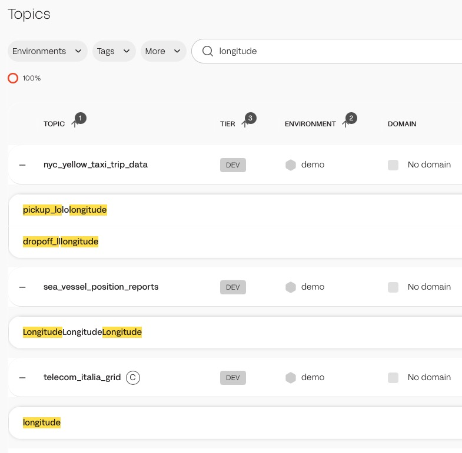

# Hands-on Labs for Lenses 6

### Lab 1 - Login and Familiarize Yourself With the UI

Using your student lab sheet point your favorite web browser to the IP address listed.

`https://studentXX.lenses-edu.com` the XX's here are your student number. You have to replace them with your student number


User name: admin

Password:  admin

The next screen you will see will ask you to verify your email. No need for this training, though you are welcome to do it if you like.


Click on Already verified? And enter the following:

Email: drew.oetzel@lenses.io

Activation Code: 1131

[

Now that you're all logged in, the Lenses help screen will pop up. It has helpful links to support and our questions forum. It also has a link to our Community Slack, you should join! But for now just click on Let's Start! 

When you first log in to the UI you are at the HQ level of Lenses. At this level you can work with multiple Kafka clusters at the same time. You can search for clusters by name or search across all clusters' topics and schemas by key words. You can also use the Global SQL Studio at this level. You can access these views via the icons down the side of the UI. 


Go ahead and click on the Topics link. Here we can see all the topics in all the clusters. These topics are fully searchable. 


Scroll over to the right to see all the different fields in the topics you can see. 

You can browse and drill down into individual topics here as well as search topics and schemas by keyword. 

Scenario: You're helping a coworker build a status dashboard for company executives. He told you that executives like dashboards with maps so he's looking for data streams with location data in them to use for his dashboard. 

Let's do a few searches to figure out which topics have location data for him to use. In the search bar for topics type in the keyword "longitude". You'll notice that three topics come up, none of them have "longitude" in their title. That's because Lenses searches inside the schemas as well. Click on Search in Schema to bring up the actual key names that Lenses surfaced. 



Now you can point your coworker quickly in the right direction for his executive dashboards.

### Lab 3 - Working with SQL Studio

Lenses comes with a handy SQL Studio desgined to allow you to explore and manupliate your topics all from one central locaiton. Let's run a basic search to understand the basics. Let's run a simple search drilling down on our taxi fare data.

```
SELECT VendorID, fare_amount, payment_type
FROM nyc_yellow_taxi_trip_data
WHERE _meta.timestamp > NOW() - "5m";
```
Note that we're using the `WHERE _meta.timestam` clause to limit our results. This isn't required, but is a best practice when working with what could be multiple gigabytes of returned results. 

We have a comprehensive guide to the Lenses SQL Studio [here in the docs](https://docs.lenses.io/latest/user-guide/sql-studio). It's quite powerful and can even be used to create new topics based on SQL output. (Beyond the scope of this introductory course.)


### Lab 4 - Working with Data Policies

Kafka streams are full of different types of sensitive data: customer data, internal data, etc. Lenses give you the ability to easily mask this data from full view by your engineers while still allowing them full access to the Topics for discovery and troubleshooting. 

Let's setup a data policy to mask the serial number data that is currently visibile in our data. If you take a look inside the `backblaze_smart` topic you'll see the serial numbers shown fully. 


Go to the Data Policies section of your Workspace and click on the New Policy button. Fill out the form:

Name: Serial Screening
Redaction: All
Category: Brand Security (Be sure to hit return here to move on the to next field, otherwise the UI will complain.)
Impact Type: Medium
Affected Datasets: Do not change. Leave as "*"
Add Fields: serial_number (Be sure to hit return here to move on the to next field, otherwise the UI will complain.)


When you're all done hit the Create New Policy button. Then go back to your topics view and drill down `backblaze_smart` and check to make sure that your serial number field is now being blocked. 


